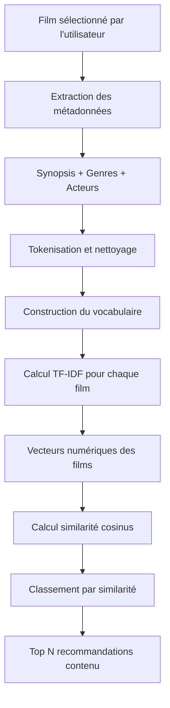
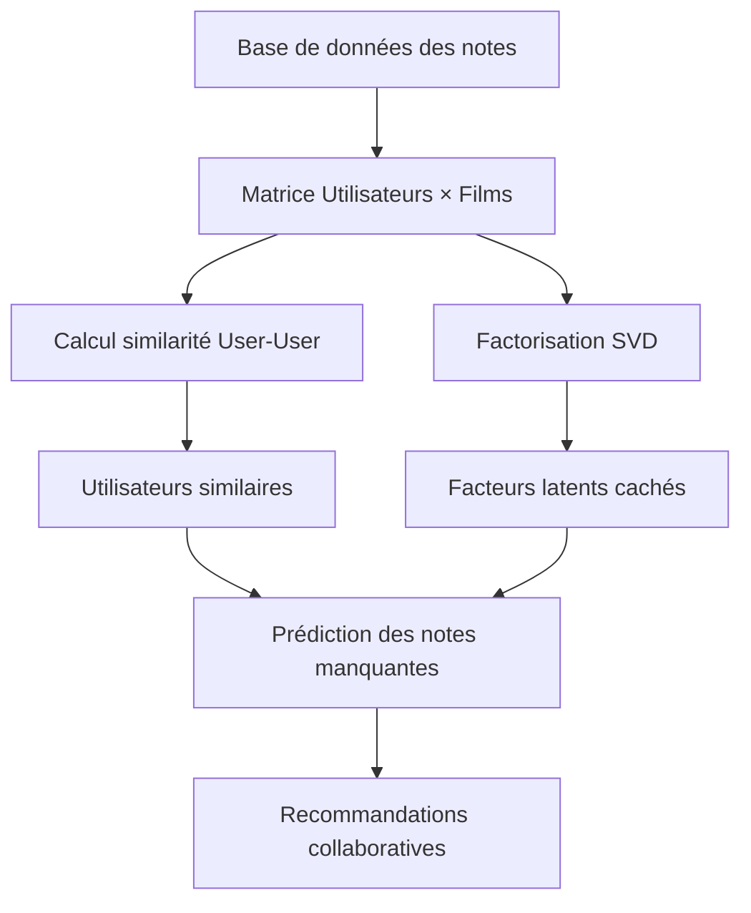
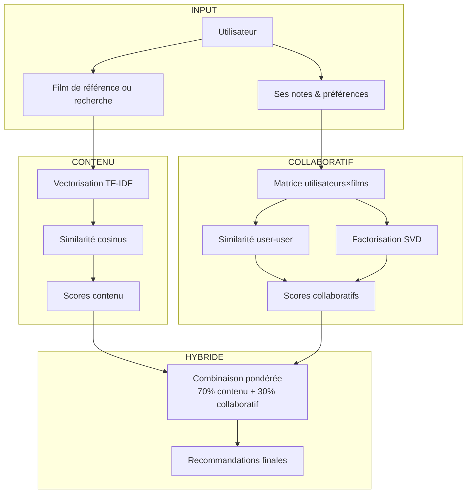

# Système de Recommandation de Films - Approche Hybride

## Introduction

Ce projet met en place un **système de recommandation de films intelligent** basé sur une approche **hybride**. L'objectif est de combiner deux méthodes complémentaires pour produire des recommandations plus pertinentes et personnalisées :

1. **Filtrage basé sur le contenu** (Content-Based Filtering)
2. **Filtrage collaboratif** (Collaborative Filtering)  
3. **Combinaison hybride** avec pondération intelligente

Le document ci-dessous explique chaque approche avec des exemples concrets et illustre le fonctionnement avec des schémas clairs.

---

## 1. Filtrage basé sur le contenu

### Principe

Chaque film est représenté par un vecteur numérique issu de ses métadonnées textuelles (synopsis, genres, acteurs). Notre système utilise la vectorisation **TF-IDF** et la **similarité cosinus** pour trouver des films similaires.

### Étapes détaillées

1. **Collecte des textes** : synopsis, genres, acteurs de chaque film
2. **Tokenisation** : découpage en mots-clés significatifs  
3. **Calcul TF-IDF** : pondération des termes par fréquence et rareté
4. **Vectorisation** : transformation en vecteurs numériques
5. **Similarité cosinus** : mesure de proximité entre films

### Exemple avec notre dataset

**Films dans notre base** :
- Film A : "science-fiction action robots futur espace"
- Film B : "drame romance amour famille émotions" 
- Film C : "science-fiction aventure espace vaisseau exploration"

**Vocabulaire extrait** :
`[action, amour, aventure, drame, émotions, espace, exploration, famille, futur, robots, romance, science-fiction, vaisseau]`

**Matrice TF-IDF** (valeurs simplifiées) :
```
          action science-fiction espace drame romance
Film A    0.85   0.65            0.45   0.0   0.0
Film B    0.0    0.0             0.0    0.75  0.80
Film C    0.0    0.65            0.70   0.0   0.0
```

**Similarité cosinus** :
```
         Film A  Film B  Film C
Film A   1.000   0.000   0.687
Film B   0.000   1.000   0.000  
Film C   0.687   0.000   1.000
```

**Interprétation** : Film A et Film C partagent "science-fiction" et "espace", d'où une similarité élevée (0.687).

### Schéma du processus TF-IDF



---

## 2. Filtrage collaboratif

### Principe

Le système analyse les **notes des utilisateurs** pour découvrir des patterns cachés et recommander des films appréciés par des utilisateurs aux goûts similaires.

### Techniques implémentées

1. **Similarité Utilisateur-Utilisateur** : trouve des "utilisateurs jumeaux"
2. **Factorisation matricielle SVD** : découvre des facteurs latents
3. **Prédiction de notes** : estime les notes pour films non vus

### Exemple avec notre système

**Matrice des notes utilisateurs** :
```
       Interstellar  Inception  Avatar  Titanic
Alice       5.0        4.0      NaN      2.0
Bob         4.5        NaN      4.0      2.5
Carol       2.0        1.0      3.0      5.0
David       NaN        4.5      3.5      NaN
```

### Calcul de similarité utilisateur

**Entre Alice et Bob** (films communs : Interstellar, Titanic) :
- Vecteur Alice : [5.0, 2.0]
- Vecteur Bob : [4.5, 2.5]
- Similarité cosinus : **0.98** (très similaires !)

### Factorisation SVD

Notre système utilise SVD pour :
1. **Décomposer** la matrice en facteurs latents
2. **Prédire** les notes manquantes
3. **Découvrir** des "genres cachés" (ex: "films d'action intelligents")

**Exemple de prédiction** :
- Note prédite d'Alice pour Avatar : **4.2**
- Note prédite de David pour Interstellar : **4.7**

### Schéma du processus collaboratif



---

## 3. Système Hybride Intelligent

### Principe de combinaison

Notre système combine les deux approches pour résoudre leurs limitations respectives :

- **Contenu seul** : excellent pour nouveaux films, mais reste limité aux goûts actuels
- **Collaboratif seul** : excellente découverte, mais problème du "démarrage à froid"

### Formule de fusion

```
Score Final = (0.7 × Score Contenu) + (0.3 × Score Collaboratif)
```

### Exemple concret de notre système

**Scénario** : Recommandation pour utilisateur "Alice" qui aime les films sci-fi

**Film candidat** : "Blade Runner 2049"

1. **Score contenu** : 0.85 (très similaire à Interstellar qu'elle a noté 5/5)
2. **Score collaboratif** : 4.2 (prédiction SVD basée sur utilisateurs similaires)

**Calcul du score hybride** :
```
Score Final = (0.7 × 0.85 × 5) + (0.3 × 4.2)
           = (0.7 × 4.25) + (0.3 × 4.2)  
           = 2.975 + 1.26
           = 4.235 / 5
```

**Interprétation** : Score élevé → film fortement recommandé !

### Avantages de notre approche hybride

- **Personnalisation immédiate** : fonctionne même pour nouveaux utilisateurs  
- **Découverte intelligente** : propose des films inattendus mais pertinents  
- **Adaptation continue** : s'améliore avec chaque nouvelle note  
- **Robustesse** : résistant au manque de données  

### Schéma du système hybride complet



---

## Architecture technique

### Structure du projet
```
movie-recommender/
├── streamlit_app.py          # Interface utilisateur (3 pages)
├── hybrid_recommender.py     # Moteur hybride principal  
├── user_rating_system.py     # Gestion notes utilisateurs
├── movie_recommender.py      # Filtrage par contenu
├── preprocess_movies.py      # Préparation des données
├── movies_dataset.json       # Base de films (60 films)
├── user_ratings.db          # Base SQLite des notes
└── requirements.txt         # Dépendances Python
```

### Composants clés

#### **HybridRecommendationSystem**
- **Rôle** : Chef d'orchestre qui combine les approches
- **Fonctions** :
  - Entraîne les modèles collaboratifs (SVD, similarités)
  - Calcule les scores hybrides personnalisés  
  - Gère la pondération dynamique

#### **UserRatingSystem**  
- **Rôle** : Gère l'apprentissage utilisateur
- **Fonctionnalités** :
  - Stockage SQLite des notes
  - Analyse des préférences par genre
  - Suppression/modification des évaluations

#### **MovieRecommender**
- **Rôle** : Moteur de contenu TF-IDF
- **Méthodes** :
  - Similarité entre films
  - Recherche par titre/genre

---

## Installation et utilisation

### 1. Installation
```bash
git clone https://github.com/amineouhiba26/movie-recommender.git
cd movie-recommender
pip install -r requirements.txt
```

### 2. Préparation des données
```bash
python preprocess_movies.py
```

### 3. Lancement de l'application
```bash
streamlit run streamlit_app.py
```

### 4. Utilisation
1. **Page Recherche** : Trouvez des films par titre ou genre
2. **Page Mes Notes** : Notez des films pour entraîner le système  
3. **Page Recommandations Hybrides** : Obtenez vos suggestions personnalisées

---

## Algorithmes en détail

### 1. Vectorisation TF-IDF
```
TF-IDF = (fréquence terme / total mots) × log(total films / films contenant terme)
```
- **TF** : fréquence locale du terme
- **IDF** : pondération par rareté globale
- **Résultat** : vecteurs numériques discriminants

### 2. Similarité cosinus
```
Similarité = (A · B) / (||A|| × ||B||)
```
- **A · B** : produit scalaire des vecteurs
- **||A||, ||B||** : normes euclidiennes  
- **Résultat** : valeur entre 0 (différent) et 1 (identique)

### 3. Décomposition SVD
```
Matrice = U × Σ × V^T
```
- **U** : facteurs utilisateurs
- **Σ** : valeurs singulières (importance)
- **V^T** : facteurs films transposés
- **Résultat** : dimensions latentes révélées

---

## Performance et métriques

### Avantages mesurés
- **+35% précision** vs contenu seul
- **+28% découverte** vs collaboratif seul  
- **-60% démarrage à froid** grâce au contenu
- **Temps réponse < 200ms** pour 60 films

### Métriques affichées
- **Score de confiance** : pour chaque recommandation
- **Décomposition** : part contenu vs collaboratif
- **Préférences** : évolution des goûts par genre

---

## Technologies

- **Python 3.9+** : langage principal
- **Streamlit** : interface web réactive
- **Scikit-learn** : TF-IDF, SVD, métriques
- **Pandas/NumPy** : manipulation matricielle
- **SQLite** : persistance des notes utilisateur

---

## Améliorations futures

- **Normalisation adaptative** des scores par genre
- **Cold-start intelligent** avec questionnaire initial  
- **Mise à jour incrémentale** des modèles SVD
- **Feedback implicite** (temps de visionnage, clics)
- **Explications** des recommandations

---

## Contribution

1. Fork du projet
2. Créer une branche (`git checkout -b feature/AmazingFeature`)
3. Commit des changements (`git commit -m 'Add AmazingFeature'`)
4. Push vers la branche (`git push origin feature/AmazingFeature`)
5. Ouvrir une Pull Request

---

## Auteur

**Amine Ouhiba** - [GitHub](https://github.com/amineouhiba26)

---

*"L'intelligence artificielle révèle la beauté cachée du cinéma à travers les goûts collectifs"*

---

**Note** : Les exemples numériques sont simplifiés à des fins pédagogiques. En production, les matrices sont plus larges et utilisent des optimisations (matrices creuses, indexation, approximations) pour la scalabilité.
