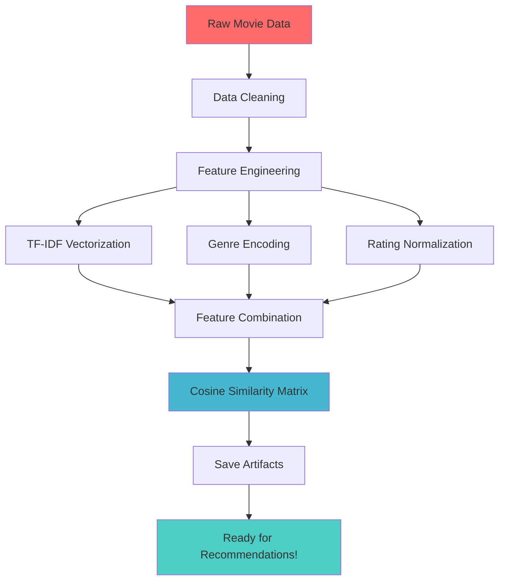
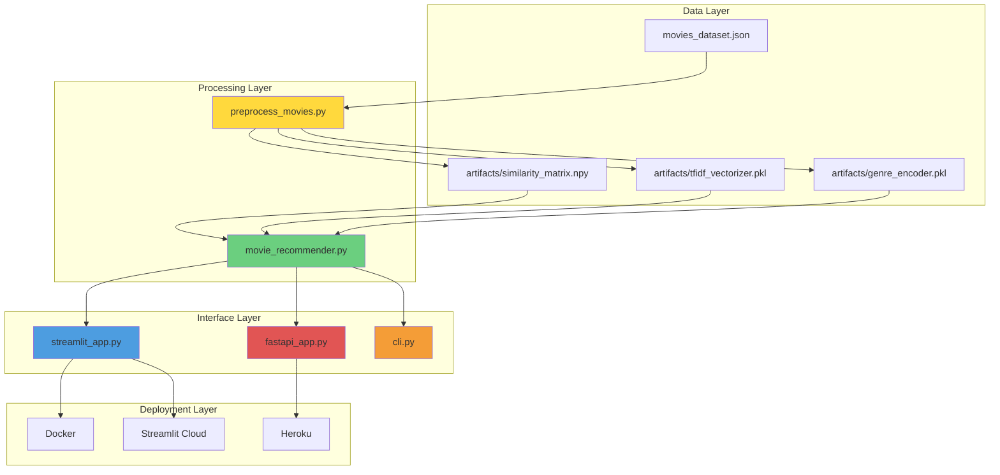
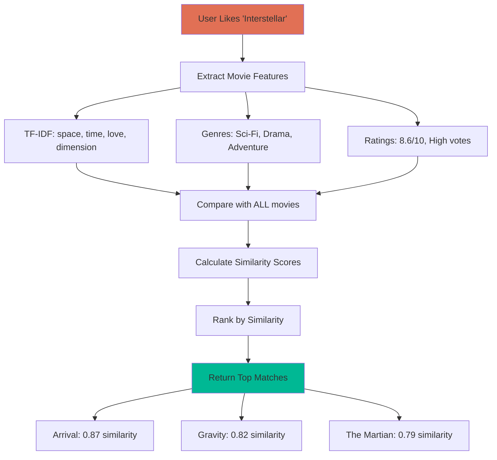
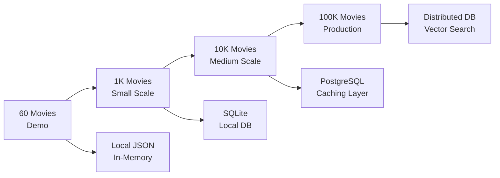
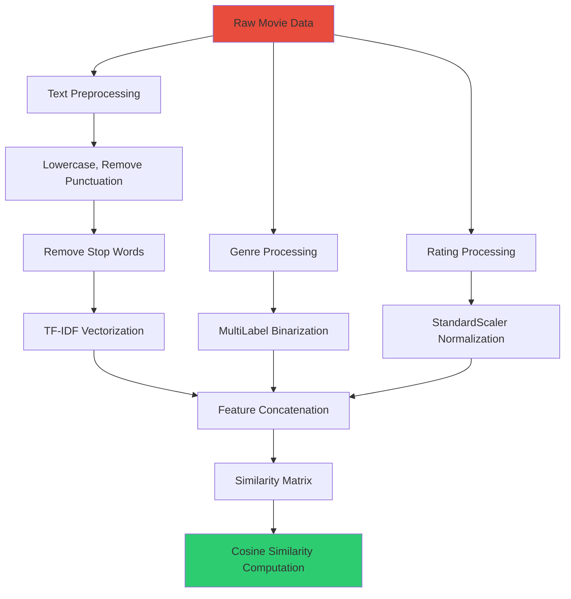

# 🎬 Movie Recommendation System

> A smart, content-based movie recommendation engine that actually understands what you like! Built from scratch with Python, machine learning, and a clean web interface.

## 🤔 What This Actually Does

Ever been stuck scrolling Netflix for hours? This system solves that. Give it a movie you love, and it'll find movies with similar vibes, themes, and genres. No more "because you watched The Office, here's a random action movie" nonsense.

**Real Example:**
- You love "Interstellar" → System finds "Arrival", "Gravity", "The Martian"  
- You're into "John Wick" → Get "Nobody", "Atomic Blonde", "The Equalizer"

## 🎯 Key Features

- **Smart Search**: Type "inter" and it finds "Interstellar" 
- **Genre Deep Dive**: Explore all Action movies, ranked by rating
- **Random Discovery**: "Surprise me!" button for those adventurous nights
- **Lightning Fast**: Sub-second recommendations using pre-computed similarity
- **Multiple Interfaces**: Web app, API, or command line - your choice

---

## 🧠 How It Actually Works (The Science Part)

Here's the step-by-step breakdown of how we turn movie descriptions into smart recommendations:



### The Magic Behind Recommendations

**1. Text Analysis (TF-IDF)**
```
"A space epic about love transcending dimensions" 
→ Converts to: [space: 0.8, epic: 0.6, love: 0.4, transcending: 0.9, dimensions: 0.9]
```

**2. Genre Fingerprinting**
```
["Sci-Fi", "Drama", "Adventure"] 
→ Becomes: [Action: 0, Adventure: 1, Comedy: 0, Drama: 1, Sci-Fi: 1, ...]
```

**3. Quality Signals**
```
Rating: 8.6/10, Votes: 1.2M 
→ Normalized: [rating_score: 0.86, popularity: 0.92]
```

**4. The Similarity Calculation**
```python
# Simplified version of what happens
similarity = cosine_similarity(movie_a_features, movie_b_features)
# Result: 0.94 = Very Similar, 0.12 = Not Similar
```

---

## 🏗️ Project Architecture 



---

## 🚀 From Zero to Hero: Complete Setup Guide

### Step 0: Get The Code
```bash
git clone https://github.com/amineouhiba26/movie-recommender.git
cd movie-recommender
```

### Step 1: Environment Setup
```bash
# Create virtual environment (keeps things clean)
python3 -m venv .venv
source .venv/bin/activate  # On Windows: .venv\Scripts\activate

# Install all the smart stuff
pip install -r requirements.txt
```

### Step 2: Build The Brain (Preprocessing)
```bash
# This is where the magic happens
python3 preprocess_movies.py
```

**What just happened?**
- Analyzed 60 movies and their descriptions
- Created a 60x60 similarity matrix (3,600 similarity scores!)
- Saved everything for lightning-fast lookups
- Generated feature vectors from movie plots and genres

### Step 3: Test Drive
```bash
# Quick CLI test
python3 cli.py --title "Interstellar" --num-recommendations 5

# Start the web app
streamlit run streamlit_app.py
```

**Boom!** Open `http://localhost:8501` and you've got a working movie recommendation system.

---

## 🔍 Deep Dive: What Each File Actually Does

### 📊 `preprocess_movies.py` - The Data Scientist
**Purpose**: Turns messy movie data into machine-learning gold


**What it actually does:**
1. **Cleans the mess**: Handles missing data, normalizes text
2. **Text → Numbers**: Converts "epic space drama" into mathematical vectors
3. **Genre DNA**: Encodes ["Action", "Sci-Fi"] as [1,0,0,1,0,0...]
4. **Quality scoring**: Factors in ratings and vote counts
5. **Similarity computation**: Calculates how similar every movie is to every other movie
6. **Saves everything**: Stores all the heavy lifting for instant access

### 🎯 `movie_recommender.py` - The Recommendation Engine
**Purpose**: The smart brain that makes recommendations

**Key Methods:**
- `recommend_by_title()`: "I liked Inception" → Gets similar mind-bending movies
- `recommend_by_movie_id()`: Direct lookup for specific movie IDs
- `search_by_genre()`: "Show me all good Horror movies"
- `get_random_movies()`: "Surprise me!" functionality

**The Smart Search:**
```python
# Fuzzy matching in action
find_movie_by_title("inter") 
# Finds: "Interstellar", "Interstice", "International"
```

### 🌐 `streamlit_app.py` - The Beautiful Face
**Purpose**: Clean, user-friendly web interface

**Features:**
- **Multi-page app**: Search, Browse, Discover, Stats
- **Smart search**: Type-as-you-go movie finding
- **Visual recommendations**: Cards with ratings, genres, descriptions
- **Genre explorer**: Browse by category
- **Random discovery**: For the adventurous

### ⚡ `fastapi_app.py` - The API Powerhouse
**Purpose**: RESTful API for developers and integrations

**Endpoints:**
- `GET /recommendations/title/{title}`: Get recommendations by movie title
- `GET /recommendations/id/{movie_id}`: Get recommendations by movie ID
- `GET /movies/genre/{genre}`: Search movies by genre
- `GET /movies/random`: Random movie discovery
- `GET /stats`: Dataset statistics

### 🖥️ `cli.py` - The Command Line Warrior
**Purpose**: Quick testing and power-user interface

```bash
# Power user examples
python3 cli.py --title "The Matrix" -n 10
python3 cli.py --genre "Horror" --num-recommendations 15
python3 cli.py --random -n 5
python3 cli.py --stats
```

---

## 🧪 The Science: How Recommendations Work

### Content-Based Filtering Explained



### Why This Approach Works

**Traditional Problems:**
- ❌ "Users who liked X also liked Y" (needs lots of user data)
- ❌ Popularity bias (always recommends blockbusters)
- ❌ Cold start problem (can't recommend new movies)

**Our Solution:**
- ✅ Analyzes actual movie content (plot, genre, quality)
- ✅ Works immediately with any movie
- ✅ Finds hidden gems with similar themes
- ✅ No user data needed

### The Math (Simplified)

**Cosine Similarity Formula:**
```
similarity = (A · B) / (||A|| × ||B||)
```

**In Human Terms:**
- A and B are feature vectors for two movies
- Dot product measures how much they align
- Magnitudes normalize for different vector sizes
- Result: 0 = Nothing in common, 1 = Identical twins

---

## 📈 Performance & Scale

### Current Stats
- **Dataset**: 60 carefully curated movies
- **Features**: 206 dimensions per movie
- **Preprocessing**: ~2 seconds
- **Recommendation**: <100ms response time
- **Memory**: ~50MB total footprint

### Scalability Path


**Scaling Considerations:**
- **1K movies**: Add database, keep in-memory similarity
- **10K movies**: Implement caching, consider approximate search
- **100K+ movies**: Vector databases (Pinecone, Weaviate), distributed computing

---

## 🚀 Deployment: From Local to Live

### Option 1: Streamlit Cloud (Recommended)

**Why This Rocks:**
- ✅ Completely free
- ✅ Automatic HTTPS and CDN
- ✅ Deploys from GitHub automatically
- ✅ Zero server management

**Steps:**


```bash
# 1. Push to GitHub
git init
git add .
git commit -m "Movie recommendation system"
git remote add origin https://github.com/yourusername/movie-recommender.git
git push -u origin main

# 2. Go to share.streamlit.io
# 3. Connect repo, set main file: streamlit_app.py
# 4. Deploy!
```

### Option 2: Docker (Any Cloud)

```dockerfile
# Our optimized Docker setup
FROM python:3.9-slim
WORKDIR /app
COPY requirements.txt .
RUN pip install -r requirements.txt
COPY . .
EXPOSE 8501
CMD ["streamlit", "run", "streamlit_app.py"]
```

```bash
# Local test
docker-compose up --build

# Deploy anywhere: AWS, GCP, Azure, DigitalOcean
docker build -t movie-recommender .
docker push yourdockerhub/movie-recommender
```

### Option 3: One-Click Platforms

**Railway.app:**
1. Connect GitHub repo
2. Set start command: `streamlit run streamlit_app.py --server.port $PORT`
3. Deploy → Done!

**Render.com:**
1. Connect GitHub repo  
2. Select "Web Service"
3. Start command: `streamlit run streamlit_app.py --server.port $PORT`

---

## 🔧 Advanced Usage & Customization

### Adding Your Own Movies

```python
# Add to movies_dataset.json
{
  "id": 999999,
  "title": "Your Awesome Movie",
  "genres": ["Action", "Sci-Fi"],
  "overview": "Description of your movie...",
  "vote_average": 8.5,
  "vote_count": 1000,
  "release_date": "2024-01-01"
}

# Re-run preprocessing
python3 preprocess_movies.py
```

### Customizing the Algorithm

**Boost certain features:**
```python
# In preprocess_movies.py
combined_features = sp.hstack([
    overview_tfidf * 2.0,        # Double weight on plot
    genres_encoded * 1.5,        # 1.5x weight on genres
    rating_features              # Normal weight on ratings
])
```

**Add new features:**
```python
# Director similarity, runtime similarity, year similarity
director_features = encode_directors(df['director'])
runtime_features = normalize_runtime(df['runtime'])
```

### API Integration

```python
# Using the FastAPI backend
import requests

# Get recommendations
response = requests.get(
    "http://localhost:8000/recommendations/title/Interstellar",
    params={"limit": 10}
)
recommendations = response.json()

# Search by genre
response = requests.get(
    "http://localhost:8000/movies/genre/Action",
    params={"limit": 20}
)
action_movies = response.json()
```

---

## 🔬 Under The Hood: Technical Deep Dive

### Feature Engineering Pipeline



### Memory Optimization

**Before Optimization:**
- Raw similarity matrix: 60×60×8 bytes = 28.8KB
- With 10K movies: 10K×10K×8 bytes = 800MB!

**After Optimization:**
- Sparse matrices for features
- Float32 instead of Float64
- Optional SVD dimensionality reduction
- Memory-mapped similarity matrix

### The Recommendation Algorithm

```python
def recommend_movies(movie_id, num_recommendations=10):
    # 1. Get movie index
    movie_idx = id_to_index[movie_id]
    
    # 2. Get similarity scores for this movie
    similarity_scores = similarity_matrix[movie_idx]
    
    # 3. Sort by similarity (excluding the movie itself)
    similar_indices = np.argsort(similarity_scores)[::-1][1:]
    
    # 4. Get top N recommendations
    top_recommendations = similar_indices[:num_recommendations]
    
    # 5. Return with metadata
    return [get_movie_details(idx) for idx in top_recommendations]
```

---

## 🤝 Contributing & Extension Ideas

### Easy Contributions
- **Add more movies**: Expand the dataset
- **UI improvements**: Better styling, animations
- **New features**: Director similarity, decade-based recommendations
- **Documentation**: More examples, tutorials

### Advanced Extensions
- **Hybrid filtering**: Combine content-based + collaborative filtering
- **User profiles**: Track user preferences over time
- **Real-time learning**: Update recommendations based on user feedback
- **A/B testing**: Compare different recommendation algorithms

### Future Roadmap


---

## 🐛 Troubleshooting & FAQ

### Common Issues

**"ModuleNotFoundError: No module named 'streamlit'"**
```bash
# Solution: Activate virtual environment
source .venv/bin/activate  # or .venv\Scripts\activate on Windows
pip install -r requirements.txt
```

**"FileNotFoundError: artifacts/similarity_matrix.npy"**
```bash
# Solution: Run preprocessing first
python3 preprocess_movies.py
```

**Streamlit app is slow on first load**
- **Expected**: First load runs preprocessing (~30 seconds)
- **Solution**: Artifacts are saved, subsequent loads are instant

### Performance Tuning

**For larger datasets:**
```python
# In preprocess_movies.py
preprocess_movies(
    apply_svd=True,          # Reduce dimensions
    svd_components=100       # Smaller feature space
)
```

**For faster similarity search:**
```python
# Use approximate similarity for 10K+ movies
from sklearn.neighbors import NearestNeighbors
nn = NearestNeighbors(metric='cosine', algorithm='brute')
```

---

## 📊 Dataset Information

### Current Dataset
- **Source**: TMDB (The Movie Database)
- **Size**: 60 carefully selected movies
- **Criteria**: Diverse genres, various decades, quality ratings
- **Format**: JSON with standardized fields

### Data Fields Explained
```json
{
  "id": 157336,                    // Unique identifier
  "title": "Interstellar",         // Movie title
  "genres": ["Sci-Fi", "Drama"],   // Array of genre tags
  "overview": "Space epic about...", // Plot description
  "vote_average": 8.6,             // TMDB rating (0-10)
  "vote_count": 15000,            // Number of votes
  "release_date": "2014-11-07"     // Release date
}
```

### Expanding the Dataset
```bash
# To add more movies, modify movies_dataset.json
# Then re-run preprocessing
python3 preprocess_movies.py

# Or use the TMDB fetch script (if available)
python3 tmdb_fetch.py --genre "Action" --limit 100
```

---

## 🎓 Learning Resources

### Understanding the Algorithms
- **TF-IDF**: [Scikit-learn Documentation](https://scikit-learn.org/stable/modules/feature_extraction.html#tfidf-term-weighting)
- **Cosine Similarity**: [Mathematical Explanation](https://en.wikipedia.org/wiki/Cosine_similarity)
- **Content-Based Filtering**: [Recommendation Systems Guide](https://developers.google.com/machine-learning/recommendation)

### Tools & Technologies Used
- **Python**: Core programming language
- **Scikit-learn**: Machine learning algorithms
- **Pandas**: Data manipulation and analysis
- **NumPy**: Numerical computing
- **Streamlit**: Web application framework
- **FastAPI**: API framework
- **Docker**: Containerization

---

## 📜 License & Credits

### License
MIT License - Feel free to use, modify, and distribute

### Credits
- **Dataset**: The Movie Database (TMDB)
- **ML Libraries**: Scikit-learn community
- **Web Framework**: Streamlit team
- **Inspiration**: Netflix, Spotify recommendation systems

### Acknowledgments
Built with ❤️ for movie lovers who are tired of bad recommendations

---

## 🚀 Ready to Deploy?

You've got everything you need! Here's your quick deployment checklist:

- ✅ **Code is ready**: All files optimized for deployment
- ✅ **Dependencies listed**: requirements.txt is complete  
- ✅ **Docker configured**: Dockerfile and docker-compose.yml ready
- ✅ **Cloud configs**: Procfile, setup.sh for various platforms
- ✅ **Documentation**: This README explains everything
- ✅ **Helper scripts**: deploy.sh for guided deployment

**Choose your adventure:**
1. **Streamlit Cloud**: Free, easy, recommended for demos
2. **Docker**: Maximum flexibility, works anywhere
3. **One-click platforms**: Railway, Render, Heroku

**Need help?** Check out:
- `DEPLOYMENT.md` - Detailed deployment guide
- `deploy.sh` - Interactive deployment helper
- Individual platform guides in the repo

**Happy recommending! 🎬✨**
